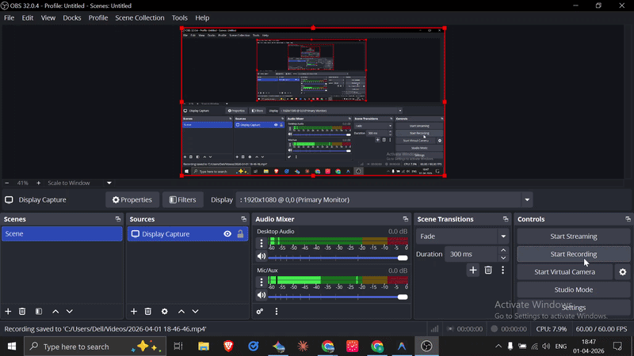

# 🎙️ Real-Time Voice Assistant with RAG

### A full-duplex voice AI system that lets you have a natural spoken conversation with your documents.
#### Built with FastAPI · GPT-4o-mini · Sarvam AI · Cartesia Sonic-3

---

## The Problem with Most Voice Bots

They follow a rigid loop — listen → think → speak → repeat. You have to wait for the bot to finish before you can say anything. It feels robotic.

This system runs all three in parallel. While the AI is speaking, it is already listening. Interrupt it mid-sentence and it immediately drops what it was saying, processes your new input, and responds — like a real conversation.

---

## 🎥 Demo


### Full walkthrough video (with sound):
<video src="https://github.com/user-attachments/assets/0cf4af4e-8dc2-4c0f-91db-405e93a6c499" width="100%" controls>
</video>

---

## ✨ Key Features

- 🗣️ **Full-Duplex Voice Interaction** — Persistent, two-way audio streaming via WebSockets. The system listens even while it is speaking, creating a truly fluid conversation loop.

- 🧠 **Intelligent Decision Making** — Powered by GPT-4o-mini with native Tool Calling. Autonomously decides per query whether to search your documents via ChromaDB or answer from general knowledge.

- 🚫 **Real-Time Barge-in** — An `asyncio.Event` kill-switch instantly terminates the active TTS stream the moment your voice is detected, letting you interrupt naturally.

- ⚡ **Parallel Pipeline Architecture** — STT, LLM, and TTS run in a pipelined fashion. The AI starts speaking the first sentence while the rest of the response is still being generated.
  - 🦻 **Ear** (Sarvam AI) — `saarika:v2.5` for multilingual speech recognition with auto language detection
  - 🧠 **Brain** (GPT-4o-mini) — Tool calling + ChromaDB RAG for document-grounded answers
  - 🔊 **Mouth** (Cartesia) — `sonic-3` for realistic 44.1kHz streaming audio

- 📜 **Persistent Context Memory** — Conversation history survives interruptions. Ask follow-ups like *"Wait, go back to what you said before"* and it will know.

- 📥 **Seamless Document Ingestion** — Upload PDFs and they are automatically chunked, embedded with `text-embedding-3-small`, and stored in ChromaDB for instant retrieval.

---


## 🏗️ How It Works

```
Browser Mic
    │  Int16 PCM @ 16kHz
    ▼
Custom VAD (SilenceDetector)
    │  triggers after 0.8s silence
    ▼
Sarvam AI STT  →  GPT-4o-mini  →  Cartesia TTS
  saarika:v2.5     tool calling     sonic-3
  auto language    ChromaDB RAG     pcm_f32le @ 44.1kHz
                       │
    ◄──────────────────┘
    audio chunks stream back as they are generated
    browser plays first chunk before full response is done
```

**🦻 Ear** — `SilenceDetector` runs RMS volume analysis on every incoming PCM chunk. Triggers after 0.8 seconds of post-speech silence.

**🧠 Brain** — GPT-4o-mini with tool calling. Decides per query whether to search ChromaDB or answer from general knowledge. Full conversation history passed every turn.

**🔊 Mouth** — Cartesia WebSocket stays persistent across sentences. Text is split into sentences and streamed in — first audio chunk arrives before the full response is generated.

---

## 🚫 Barge-in

The moment your voice is detected while the AI is speaking, an `asyncio.Event` kill switch fires — cancelling the active TTS stream instantly.

```python
async for audio_chunk in text_to_speech(response):
    if barge_in_event.is_set():
        break  # drop everything, go back to listening
    await websocket.send_bytes(audio_chunk)
```

---

## 🛠️ Tech Stack

| Layer | Technology | Model |
|---|---|---|
| Backend | FastAPI + Python 3.12 | — |
| STT | Sarvam AI | `saarika:v2.5` |
| LLM | OpenAI | `gpt-4o-mini` |
| Embeddings | OpenAI | `text-embedding-3-small` |
| TTS | Cartesia | `sonic-3` |
| Vector DB | ChromaDB | Local persistent |
| Concurrency | asyncio | Parallel pipeline |
| Frontend | Web Audio API | — |

---

## ⚡ Latency

| Stage | Typical |
|---|---|
| VAD trigger | < 50ms |
| Sarvam STT | 400–700ms |
| GPT-4o-mini first token | 500–900ms |
| Cartesia first audio chunk | < 100ms |
| **Time to first audio** | **~2–3 seconds** |

---

## 📁 Project Structure

```
├── app/
│   ├── routes/
│   │   ├── voice.py        # WebSocket, VAD, STT, TTS pipeline
│   │   ├── documents.py    # PDF upload and ingestion
│   │   └── chat.py         # REST endpoints
│   └── services/
│       ├── rag.py          # GPT-4o-mini + tool calling
│       └── embedding.py    # Embeddings + ChromaDB
└── voice_chat.html         # Browser client (Web Audio API)
```
